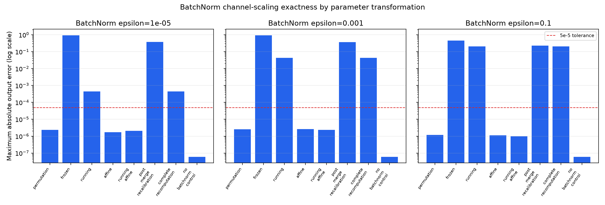
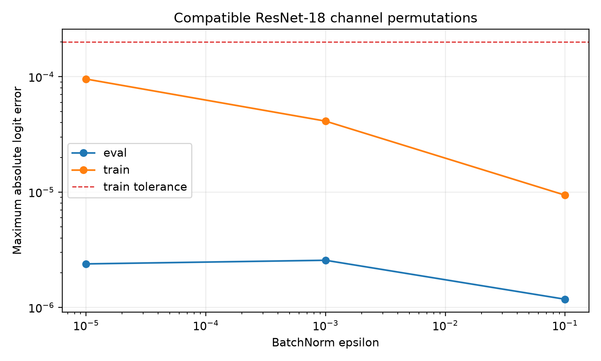

# BatchNorm-aware channel-gauge exactness report

## Verdict

Compatible ResNet-18 channel permutations are **exact within the preregistered float32 numerical tolerance** in eval and train modes. Positive channel scaling is eval-exact only under explicitly frozen-statistic parameterizations (`affine` or `running_affine`). Scaling running mean and variance alone is not exact for nonzero BatchNorm epsilon. Arbitrary channelwise positive scaling is not claimed train-mode exact.

## Protocol

- Stage: `confirmatory`; seeds: `0,1,2,3,4`; epsilons: `1e-05,0.001,0.1`.
- Random pretrained-free ResNet-18 parameter states are used because this is a functional identity test, not a performance benchmark.
- Each row covers `4` independent input batches of size `4`.
- Permutations cover Conv outputs, following Conv inputs, residual branches, projected shortcuts, BatchNorm affine parameters and buffers, and classifier inputs.
- Identity shortcuts enforce equal input/output bases.
- No parameters, branches, width, or inference operations are added.
- Failures: `0`.

## Primary exactness summary

| strategy | mode | epsilon | n_seeds | max_overall_logit_error | mean_absolute_logit_error | max_prediction_disagreement | all_exactness_checks_passed |
| --- | --- | --- | --- | --- | --- | --- | --- |
| permutation | eval | 1e-05 | 5 | 2.38419e-06 | 5.00065e-07 | 0 | True |
| permutation | train | 1e-05 | 5 | 9.54792e-05 | 1.2283e-05 | 0 | True |
| running | eval | 1e-05 | 5 | 0.000440717 | 7.60895e-05 | 0 | False |
| running | train | 1e-05 | 5 | 0.000896633 | 0.000131636 | 0.0625 | False |
| affine | eval | 1e-05 | 5 | 1.72108e-06 | 4.76824e-07 | 0 | True |
| affine | train | 1e-05 | 5 | 2.39051 | 0.542051 | 0.9375 | False |
| running_affine | eval | 1e-05 | 5 | 2.08616e-06 | 4.7976e-07 | 0 | True |
| running_affine | train | 1e-05 | 5 | 0.0103297 | 0.00136831 | 0.0625 | False |
| no_batchnorm_control | eval | 1e-05 | 5 | 5.96046e-08 | 4.76583e-09 | 0 | True |
| no_batchnorm_control | train | 1e-05 | 5 | 5.96046e-08 | 4.76583e-09 | 0 | True |
| permutation | eval | 0.001 | 5 | 2.563e-06 | 5.24075e-07 | 0 | True |
| permutation | train | 0.001 | 5 | 4.12166e-05 | 9.13613e-06 | 0 | True |
| running | eval | 0.001 | 5 | 0.0427345 | 0.00668412 | 0.0625 | False |
| running | train | 0.001 | 5 | 0.0478571 | 0.00974617 | 0.0625 | False |
| affine | eval | 0.001 | 5 | 2.65241e-06 | 4.64431e-07 | 0 | True |
| affine | train | 0.001 | 5 | 2.40937 | 0.53384 | 0.875 | False |
| running_affine | eval | 0.001 | 5 | 2.38419e-06 | 4.64947e-07 | 0 | True |
| running_affine | train | 0.001 | 5 | 0.412956 | 0.0866274 | 0.25 | False |
| no_batchnorm_control | eval | 0.001 | 5 | 5.96046e-08 | 4.76583e-09 | 0 | True |
| no_batchnorm_control | train | 0.001 | 5 | 5.96046e-08 | 4.76583e-09 | 0 | True |
| permutation | eval | 0.1 | 5 | 1.17719e-06 | 2.63946e-07 | 0 | True |
| permutation | train | 0.1 | 5 | 9.40263e-06 | 2.42631e-06 | 0 | True |
| running | eval | 0.1 | 5 | 0.202987 | 0.0391514 | 0.375 | False |
| running | train | 0.1 | 5 | 0.659661 | 0.168276 | 0.5 | False |
| affine | eval | 0.1 | 5 | 1.11759e-06 | 2.56584e-07 | 0 | True |
| affine | train | 0.1 | 5 | 1.22775 | 0.314493 | 0.8125 | False |
| running_affine | eval | 0.1 | 5 | 9.98378e-07 | 2.50083e-07 | 0 | True |
| running_affine | train | 0.1 | 5 | 0.730993 | 0.193006 | 0.625 | False |
| no_batchnorm_control | eval | 0.1 | 5 | 5.96046e-08 | 4.76583e-09 | 0 | True |
| no_batchnorm_control | train | 0.1 | 5 | 5.96046e-08 | 4.76583e-09 | 0 | True |

## Parameterization comparisons

| comparison | n_pairs | n_seeds | paired_mean_max_error_delta | paired_delta_ci_low | paired_delta_ci_high | wins_lower_error | ties | losses_higher_error |
| --- | --- | --- | --- | --- | --- | --- | --- | --- |
| running_minus_frozen | 15 | 5 | -0.620448 | -0.690831 | -0.545079 | 15 | 0 | 0 |
| affine_minus_frozen | 15 | 5 | -0.678174 | -0.737306 | -0.619041 | 15 | 0 | 0 |
| running_affine_minus_running | 15 | 5 | -0.0577252 | -0.0709807 | -0.0460441 | 15 | 0 | 0 |
| complete_recomputation_minus_post_merge_recalibration | 15 | 5 | -0.24262 | -0.261177 | -0.222164 | 14 | 0 | 1 |

## Interpretation

- `permutation`: exact graph-wide basis change, including residual addition and shortcut projections.
- `affine`: exact only in eval mode with original frozen running statistics; the stored statistics no longer describe the scaled Conv output.
- `running_affine`: exact only in eval mode after transforming running statistics and applying the epsilon-aware affine correction.
- `running`: approximate because `sqrt(s^2 v + epsilon)` differs from `s sqrt(v + epsilon)`.
- `post_merge_recalibration` and `complete_recomputation`: approximate unless followed by the frozen-statistic epsilon-aware affine correction.
- `no_batchnorm_control`: exact positive ReLU gauge in eval and train modes.

Train-mode errors for the static scaling parameterizations are negative evidence and remain in `exactness.csv`. Per-location canonicalized activation errors before and after residual blocks are in `activations.csv`. Deep train-mode activation comparisons accumulate float32 reduction-order differences (maximum `0.000900745`); the preregistered exactness decision is logit-level, whose train-mode maximum remains below `2e-4` with zero prediction disagreement.

## Commands

Smoke:

```bash
/Users/tinggong/Documents/GitHub/TwistedMerge/.venv/bin/python experiments/batchnorm_gauge_exactness.py --stage smoke
```

Confirmatory:

```bash
/Users/tinggong/Documents/GitHub/TwistedMerge/.venv/bin/python experiments/batchnorm_gauge_exactness.py --stage confirmatory
```




