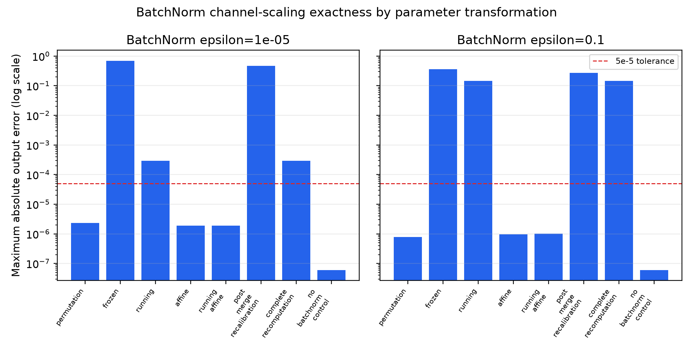
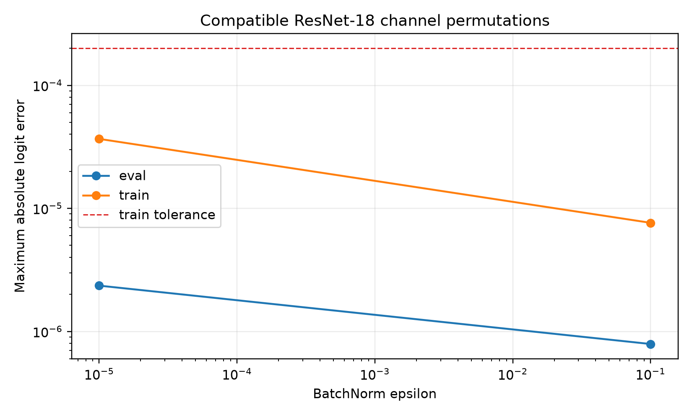

# BatchNorm-aware channel-gauge exactness report

## Verdict

Compatible ResNet-18 channel permutations are **exact within the preregistered float32 numerical tolerance** in eval and train modes. Positive channel scaling is eval-exact only under explicitly frozen-statistic parameterizations (`affine` or `running_affine`). Scaling running mean and variance alone is not exact for nonzero BatchNorm epsilon. Arbitrary channelwise positive scaling is not claimed train-mode exact.

## Protocol

- Stage: `pilot`; seeds: `0,1`; epsilons: `0.00001,0.1`.
- Random pretrained-free ResNet-18 parameter states are used because this is a functional identity test, not a performance benchmark.
- Each row covers `2` independent input batches of size `4`.
- Permutations cover Conv outputs, following Conv inputs, residual branches, projected shortcuts, BatchNorm affine parameters and buffers, and classifier inputs.
- Identity shortcuts enforce equal input/output bases.
- No parameters, branches, width, or inference operations are added.
- Failures: `0`.

## Primary exactness summary

| strategy | mode | epsilon | n_seeds | max_overall_logit_error | mean_absolute_logit_error | max_prediction_disagreement | all_exactness_checks_passed |
| --- | --- | --- | --- | --- | --- | --- | --- |
| permutation | eval | 1e-05 | 2 | 2.35438e-06 | 5.32204e-07 | 0 | True |
| permutation | train | 1e-05 | 2 | 3.67016e-05 | 1.23082e-05 | 0 | True |
| running | eval | 1e-05 | 2 | 0.000292063 | 7.61449e-05 | 0 | False |
| running | train | 1e-05 | 2 | 0.000852346 | 0.000152977 | 0.125 | False |
| affine | eval | 1e-05 | 2 | 1.90735e-06 | 4.70574e-07 | 0 | True |
| affine | train | 1e-05 | 2 | 1.94031 | 0.52641 | 0.875 | False |
| running_affine | eval | 1e-05 | 2 | 1.90735e-06 | 4.91529e-07 | 0 | True |
| running_affine | train | 1e-05 | 2 | 0.0076353 | 0.00150612 | 0 | False |
| no_batchnorm_control | eval | 1e-05 | 2 | 5.96046e-08 | 5.732e-09 | 0 | True |
| no_batchnorm_control | train | 1e-05 | 2 | 5.96046e-08 | 5.732e-09 | 0 | True |
| permutation | eval | 0.1 | 2 | 7.89762e-07 | 2.81092e-07 | 0 | True |
| permutation | train | 0.1 | 2 | 7.62939e-06 | 2.25503e-06 | 0 | True |
| running | eval | 0.1 | 2 | 0.144248 | 0.0397091 | 0.5 | False |
| running | train | 0.1 | 2 | 0.640071 | 0.173177 | 0.375 | False |
| affine | eval | 0.1 | 2 | 9.53674e-07 | 2.38616e-07 | 0 | True |
| affine | train | 0.1 | 2 | 1.01539 | 0.281635 | 0.75 | False |
| running_affine | eval | 0.1 | 2 | 1.01328e-06 | 2.27743e-07 | 0 | True |
| running_affine | train | 0.1 | 2 | 0.729746 | 0.20501 | 0.625 | False |
| no_batchnorm_control | eval | 0.1 | 2 | 5.96046e-08 | 5.732e-09 | 0 | True |
| no_batchnorm_control | train | 0.1 | 2 | 5.96046e-08 | 5.732e-09 | 0 | True |

## Parameterization comparisons

| comparison | n_pairs | n_seeds | paired_mean_max_error_delta | paired_delta_ci_low | paired_delta_ci_high | wins_lower_error | ties | losses_higher_error |
| --- | --- | --- | --- | --- | --- | --- | --- | --- |
| running_minus_frozen | 4 | 2 | -0.446038 | -0.45794 | -0.434136 | 4 | 0 | 0 |
| affine_minus_frozen | 4 | 2 | -0.50618 | -0.530209 | -0.48215 | 4 | 0 | 0 |
| running_affine_minus_running | 4 | 2 | -0.0601411 | -0.0722684 | -0.0480137 | 4 | 0 | 0 |
| complete_recomputation_minus_post_merge_recalibration | 4 | 2 | -0.27922 | -0.32112 | -0.23732 | 4 | 0 | 0 |

## Interpretation

- `permutation`: exact graph-wide basis change, including residual addition and shortcut projections.
- `affine`: exact only in eval mode with original frozen running statistics; the stored statistics no longer describe the scaled Conv output.
- `running_affine`: exact only in eval mode after transforming running statistics and applying the epsilon-aware affine correction.
- `running`: approximate because `sqrt(s^2 v + epsilon)` differs from `s sqrt(v + epsilon)`.
- `post_merge_recalibration` and `complete_recomputation`: approximate unless followed by the frozen-statistic epsilon-aware affine correction.
- `no_batchnorm_control`: exact positive ReLU gauge in eval and train modes.

Train-mode errors for the static scaling parameterizations are negative evidence and remain in `exactness.csv`. Per-location canonicalized activation errors before and after residual blocks are in `activations.csv`. Deep train-mode activation comparisons accumulate float32 reduction-order differences (maximum `0.000639677`); the preregistered exactness decision is logit-level, whose train-mode maximum remains below `2e-4` with zero prediction disagreement.

## Commands

Smoke:

```bash
/Users/tinggong/Documents/GitHub/TwistedMerge/.venv/bin/python experiments/batchnorm_gauge_exactness.py --stage smoke
```

Confirmatory:

```bash
/Users/tinggong/Documents/GitHub/TwistedMerge/.venv/bin/python experiments/batchnorm_gauge_exactness.py --stage confirmatory
```




