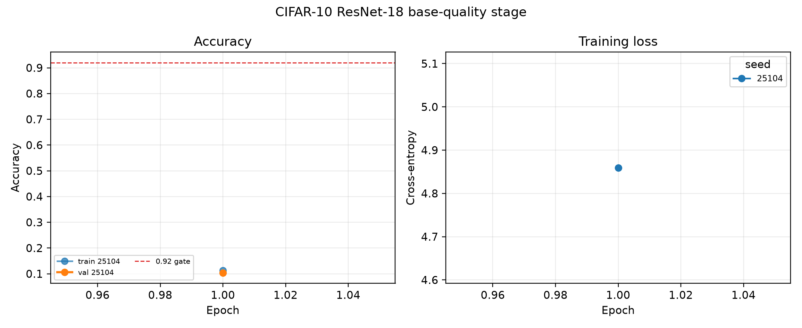

# CIFAR-10 ResNet-18 base-quality smoke

## Verdict

Status: **smoke_only**.

This stage evaluates individual-model training quality only. It is not a model-merging result, and the CIFAR-10 test partition was not loaded or evaluated. A confirmatory merge run remains forbidden unless the validation-only pilot gate passes and the recipe is frozen.

## Protocol

- Architecture: torchvision ResNet-18 with `3x3`, stride-1 CIFAR stem and no max-pool.
- Training: SGD, momentum `0.9`, Nesterov, weight decay `0.0005`, cosine decay, `0` warmup epochs.
- Data: deterministic train/validation split with `2048` training and `512` validation examples in this stage; random crop with padding 4, horizontal flip, and channel normalization on training only.
- Epochs: `1`; batch size: `128`; initial learning rate: `0.1`.
- Model seeds: `25104`.
- Failures: `0`.
- Base gate: mean validation accuracy >= `0.92`, minimum >= `0.9`, and seed standard deviation <= `0.015`.

## Individual models

| seed | validation_accuracy | validation_nll | validation_ece | validation_brier | validation_worst_class_accuracy | best_epoch |
| --- | --- | --- | --- | --- | --- | --- |
| 25104 | 0.103516 | 861.958 | 0.87086 | 1.76245 | 0 | 1 |

## Aggregate gate

```json
{
  "completed_models": 1,
  "expected_models": 1,
  "gate_interpretable": false,
  "mean_gate": 0.92,
  "minimum_gate": 0.9,
  "stage": "smoke",
  "standard_deviation_gate": 0.015,
  "status": "smoke_only",
  "test_evaluations": 0,
  "validation_accuracy_mean": 0.103515625,
  "validation_accuracy_min": 0.103515625,
  "validation_accuracy_std": 0.0
}
```

## Leakage boundary

The pilot chooses and freezes the training recipe using the held-out validation partition only. There are zero test evaluations in the epoch log and resource ledger. Final test evaluation is reserved for a later frozen confirmatory protocol.

## Reproduction

```bash
/Users/tinggong/Documents/GitHub/TwistedMerge/.venv/bin/python experiments/post_iclr_resnet18_cifar10.py --stage smoke
```


