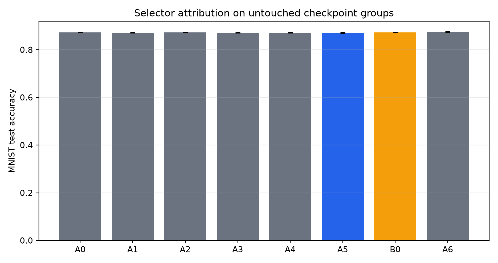
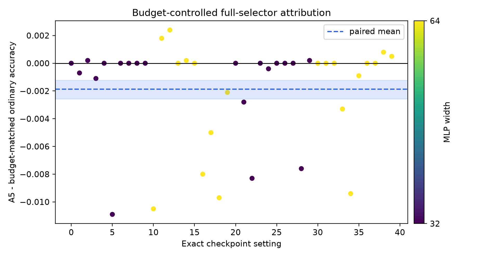

# Post-ICLR selector-attribution report

## Verdict

**enriched-pool selection; no TwistedMerge-specific algorithmic gain established.**

The confirmatory unit is the independent training-group seed. Settings sharing a seed across model count and width are averaged before the paired bootstrap. The study contains `10` independent groups and `40` exact checkpoint settings. Failed official candidates: `0`.

## Frozen protocol

- Stage: `confirmatory`.
- Seeds: `9300,9301,9302,9303,9304,9305,9306,9307,9308,9309`; model counts: `3,4`; widths: `32,64`.
- Recipe: Adam, learning rate `0.001`, `3` epochs, `5000` sampled MNIST training examples, validation fraction `0.2`.
- Every selector sees the identical checkpoint group in a setting.
- A0--A5 and B0 are frozen from validation metrics before test evaluation. A6 alone uses test metrics and is an oracle upper bound.
- B0 exactly matches A5's candidate count and selector validation-evaluation count. Candidate-generation kernels and compute are not exactly equal; `budget_audit.csv` reports the difference.
- A4 uses the frozen residual threshold `0.22743056`: above threshold it falls back to A0; otherwise it chooses from A1.
- A5 includes no lift: the current claim ledger does not certify a natural-MNIST lift candidate.
- Git Re-Basin and C2M3 are adapter-assisted official cores, not unmodified end-to-end runs.

Smoke command:

```bash
/Users/tinggong/Documents/GitHub/TwistedMerge/.venv/bin/python experiments/post_iclr_selector_attribution.py --stage smoke --data-dir /Users/tinggong/Documents/GitHub/TwistedMerge/data --official-root /Users/tinggong/Documents/Codex/2026-07-17/files-mentioned-by-the-user-you/work/official-baseline-sources --jax-python /Users/tinggong/Documents/Codex/2026-07-17/files-mentioned-by-the-user-you/work/official-git-rebasin-py312-venv/bin/python
```

Confirmatory command:

```bash
/Users/tinggong/Documents/GitHub/TwistedMerge/.venv/bin/python experiments/post_iclr_selector_attribution.py --stage confirmatory --data-dir /Users/tinggong/Documents/GitHub/TwistedMerge/data --official-root /Users/tinggong/Documents/Codex/2026-07-17/files-mentioned-by-the-user-you/work/official-baseline-sources --jax-python /Users/tinggong/Documents/Codex/2026-07-17/files-mentioned-by-the-user-you/work/official-git-rebasin-py312-venv/bin/python
```

## Selector summary

| selector | n_exact_settings | n_training_groups | mean_test_accuracy | median_test_accuracy | std_test_accuracy | mean_test_loss | mean_regret_vs_greedy_soup | mean_regret_vs_oracle | worst_setting_accuracy | tm_specific_selection_frequency | validation_test_best_agreement |
| --- | --- | --- | --- | --- | --- | --- | --- | --- | --- | --- | --- |
| A0 | 40 | 10 | 0.8726 | 0.8734 | 0.0103 | 0.5376 | 0.0000 | 0.0016 | 0.8480 | 0.0000 | 0.3250 |
| A1 | 40 | 10 | 0.8716 | 0.8716 | 0.0103 | 0.5577 | 0.0010 | 0.0026 | 0.8472 | 0.0000 | 0.2750 |
| A2 | 40 | 10 | 0.8726 | 0.8734 | 0.0103 | 0.5376 | 0.0000 | 0.0016 | 0.8480 | 0.0000 | 0.3250 |
| A3 | 40 | 10 | 0.8714 | 0.8723 | 0.0104 | 0.5530 | 0.0011 | 0.0027 | 0.8480 | 0.7000 | 0.3500 |
| A4 | 40 | 10 | 0.8716 | 0.8716 | 0.0103 | 0.5577 | 0.0010 | 0.0026 | 0.8472 | 0.0000 | 0.2750 |
| A5 | 40 | 10 | 0.8707 | 0.8714 | 0.0106 | 0.5699 | 0.0019 | 0.0034 | 0.8472 | 0.6500 | 0.3000 |
| B0 | 40 | 10 | 0.8726 | 0.8734 | 0.0103 | 0.5376 | 0.0000 | 0.0016 | 0.8480 | 0.0000 | 0.3250 |
| A6 | 40 | 10 | 0.8741 | 0.8742 | 0.0095 | 0.5434 | -0.0016 | 0.0000 | 0.8571 | 0.3750 | 1.0000 |

## Paired attribution

| comparison | n_exact_settings | n_training_groups | paired_mean_accuracy_delta | paired_accuracy_delta_ci_low | paired_accuracy_delta_ci_high | wins | ties | losses | paired_effect_size_dz |
| --- | --- | --- | --- | --- | --- | --- | --- | --- | --- |
| A5_minus_A0 | 40 | 10 | -0.0019 | -0.0026 | -0.0012 | 7 | 18 | 15 | -0.5089 |
| A5_minus_A1 | 40 | 10 | -0.0009 | -0.0014 | -0.0004 | 7 | 23 | 10 | -0.3557 |
| A5_minus_A2 | 40 | 10 | -0.0019 | -0.0026 | -0.0012 | 7 | 18 | 15 | -0.5089 |
| A5_minus_A3 | 40 | 10 | -0.0007 | -0.0015 | -0.0001 | 1 | 35 | 4 | -0.2779 |
| A5_minus_A4 | 40 | 10 | -0.0009 | -0.0014 | -0.0004 | 7 | 23 | 10 | -0.3557 |
| A5_minus_B0 | 40 | 10 | -0.0019 | -0.0026 | -0.0012 | 7 | 18 | 15 | -0.5089 |
| A4_minus_A1_same_pool_diagnostic_rule | 40 | 10 | 0.0000 | 0.0000 | 0.0000 | 0 | 40 | 0 | NA |

The primary controlled comparison A5 - B0 is `-0.0019` with group-bootstrap 95% CI `[-0.0026, -0.0012]`.

## A5 selections

| selected_family | selected_candidate | count | frequency | tm_specific | conditional_mean_gain_vs_a0 |
| --- | --- | --- | --- | --- | --- |
| monomial_gauge_soup | monomial_gauge_soup | 9 | 0.2250 | True | -0.0014 |
| official_synchronization | official_c2m3 | 1 | 0.0250 | False | 0.0018 |
| official_synchronization | official_git_rebasin | 4 | 0.1000 | False | -0.0077 |
| ordinary_soup | greedy_soup | 9 | 0.2250 | False | 0.0000 |
| permutation_gauge_soup | permutation_gauge_soup | 2 | 0.0500 | True | 0.0000 |
| union_gauge_soup | union_gauge_soup | 15 | 0.3750 | True | -0.0022 |

TwistedMerge-specific selection frequency is `0.650`. Conditional rows are reported even when negative or absent.

## Preregistered success gates

```json
[
  {
    "ci_high": -0.0012149999999999828,
    "ci_low": -0.0025775625000000017,
    "criterion": "A5 beats B0 with positive group-bootstrap CI",
    "passed": false,
    "value": -0.0018649999999999945
  },
  {
    "conditional_gain": -0.0017576923076922978,
    "criterion": "TM-specific choice has nontrivial frequency and positive conditional gain",
    "passed": false,
    "value": 0.65
  },
  {
    "ci_high": 0.0,
    "ci_low": 0.0,
    "criterion": "A4 residual rule reduces regret with same pool",
    "passed": false,
    "value": 0.0
  },
  {
    "a5_worst": 0.8472,
    "b0_worst": 0.848,
    "criterion": "A5 improves worst setting without material mean loss",
    "passed": false
  }
]
```

## Budget and stability interpretation

Pool size and final selector evaluation count are exactly controlled by B0. Generation compute cannot be made identical because official synchronization, exact gauges, and greedy soup construction use different kernels; it is timed and counted rather than hidden. Validation-resampling stability is computed from per-example validation losses and correctness without touching test labels.

## Capacity and cost

Every A0--A6 candidate is a single, same-width MLP at inference. Soup candidates are materialized as one averaged model. There are no ensembles, wider models, branch lifts, or rank lifts. Per-candidate parameters, stored bytes, latency, merge time, training time, peak process memory, branches, and validation evaluations are in `resource_accounting.csv`.

## Reproducibility and negative results

`config.json`, `checkpoint_manifest.csv`, `failure_log.csv`, and `artifact_manifest.csv` record the recipe, split and dataset checksums, checkpoint provenance, external source commits, environment, commands, and output hashes. Official failures are never replaced by internal methods. Per-setting unfavorable results remain in `runs.csv` and `selectors.csv`.

Focused tests, run counts, checksum verification, and the unrelated repository-wide test-suite hang are recorded in `verification.md`.




